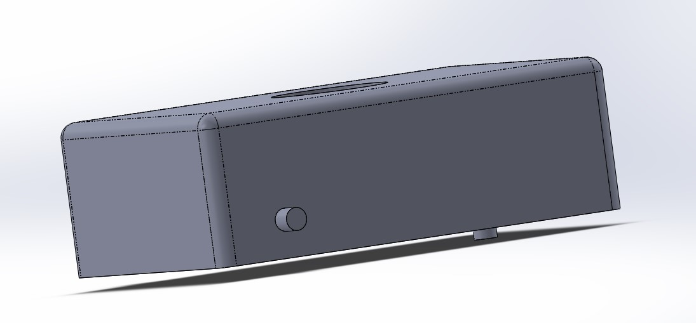

# Mobile-Robot-Simulation-in-CoppeliaSim

# OBJECTIVES
1. Build a clean CAD model for 3(2 side + 1 castor) Wheeled Mobile Robot and generate the URDF using SW2URDF exporter Plugin.
2. Export the URDF to the coppeliasim simulator (Vrep).
3. Control The robot with Lua, Python and MATLAB.
4. ROS Coppeliasim Control.

## Building CAD model of wheeled mobile robot
To make the mobile robot with two side and one castor wheel make the following parts in the solidworks.

A. Body :- for body I created a cuboid shape of size 300x200x100 mm and three extend shafts of 15 mm diameter two for rear wheel and front wheel.
 \

B. Front wheel, wheel holder and rear wheel:- wheel is of 60 mm diameter and 15 mm hole for shaft and rear wheel has a diameter of 200 mm.
 \
C. Final Assembly:- After assembling all the parts we will get a mobile robot as shown in below figure.

## Solidworks to URDF file conversion
To convert solidworks assembly into urdf file
1.	Open  your assembly in SolidWorks.
2.	Set the position of your joints as you would like them exported
3.	Go to “File>Export to URDF”
On clicking on Export to URDF it will open “Property Manager” window as shown below.

1. **Property manager:** \
Here you will need to configure each link and build the tree manually. After configuring this for the first time, the tool will save your configuration with the assembly itself. For each link, you need to give it a unique name, give it a unique joint name, select the components in SolidWorks that are to be associated with that link and add the necessary number of children. The configuration tree shows you all the links you've added. For each child link on the tree, a joint will be created to its parent link. You can select any link you've already added to change its properties. Right clicking a link will allow you to add children to or remove the link.
Now click "Preview and Export". If you have specified the tool to automatically generate coordinate systems or axes, it will build them at this stage. \
 \

2. **Joint Properties:**
In this window you can change the reference coordinate systems and axes to suit your needs outside of the exporter. However, the model will work fine built as-is.
The joint page includes a non-configurable joint tree, where clicking each joint will bring up its properties on the right-hand side. You can customize the properties of any joint before exporting. These properties will not be saved however with the configuration. They will need to be re-entered each time.
Fields that are initially blank are not required by the urdf specifications. If they are left blank they will not be written to the URDF file. If you change a property of a section that includes other required fields, but neglect to specify them, they will be filled in with 0.
Click next to go to the Link Properties page. \
 \

3. **Link Properties:**
This page presents a similar view to the Part Exporter discussed earlier. You can change the link properties of any link in your tree. You can add a texture, change the color, change the origins of different sections, change the moment of inertia tensor, mass, etc. These changes will also not be saved with your configuration.
 \

4. **The Build Package**
On clicking Export and Meshes the urdf file will be created. The package will contain directories for meshes, textures and robots. It will also contain a ROS package.xml (manifest) file so you can use this as a ROS package by just copying it to your ROS system. 

## Importing URDF file in Coppeliasim 
